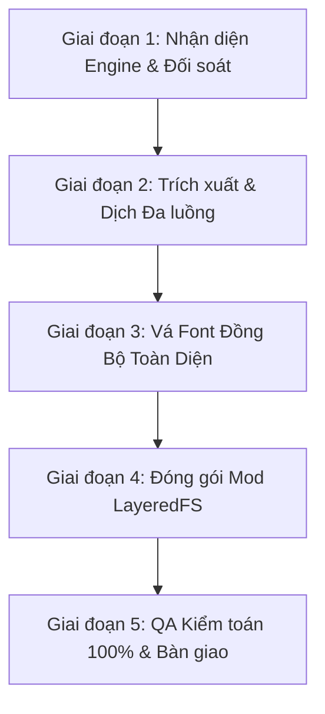

# LỆNH ĐIỀU HÀNH TỰ ĐỘNG HÓA DỊCH GAME ĐA DỤNG: `/dich`

Khi người dùng gõ `/dich` (kèm hoặc không kèm tên game/TitleID):
Agent ngay lập tức kích hoạt chế độ **Tổng Chỉ Huy Tự Động (Universal Autonomous Localization Director)**, tự hành 100% từ đầu đến cuối theo quy trình chuẩn quốc tế 5 giai đoạn, áp dụng đa năng cho **mọi tựa game Nintendo Switch**.

---

## NGUYÊN TẮC VẬN HÀNH BẤT DI BẤT DỊCH (AUTONOMOUS DIRECTIVE)
1. **Quy trình khép kín không gián đoạn**: Tuyệt đối không dừng lại giữa chừng để hỏi "bạn có muốn tiếp tục không?". Chỉ báo cáo khi toàn bộ gói mod đã build xong 100% không lỗi.
2. **Khả năng tự thích ứng Engine (Universal Engine Agnostic)**: Tự động phân tích cấu trúc RomFS để nhận diện engine của game (Nintendo EPD, Unity, Unreal Engine, Supergiant SJSON, Monogame, RPG Maker...).
3. **Cơ chế tự sửa lỗi (Self-Healing Loop)**: Nếu QA phát hiện lệch tag, tràn dòng UI, sai mã điều khiển hoặc lỗi font, agent tự động mở file hiệu chỉnh và build lại ngay trong cùng phiên.
4. **Tiêu chuẩn "Translate Book"**:
   - Dịch theo ngữ cảnh game thủ, văn phong tự nhiên.
   - Tuyệt đối không dịch thô (word-by-word), không bị động cứng nhắc ("bị ... bởi").
   - Tuyệt đối không bịa đặt (hallucination).
   - Bảo toàn 100% mã nút bấm Switch (``, ``...), control tag (`\u000e...`, `{#...}`, `{!Icons...}`), placeholder (`%s`, `{0}`, `{$...}`).

---

## QUY TRÌNH CHUẨN 5 GIAI ĐOẠN ĐA DỤNG CHO MỌI GAME



### GIAI ĐOẠN 1: NHẬN DIỆN ENGINE & KHỞI TẠO BỘ NHỚ
1. **Xác định Game mục tiêu**:
   - Đọc `docs/STATE.md` để lấy Title ID, cấu trúc file và tiến độ hiện tại.
   - **Tìm ROM tự động** (không hardcode đường dẫn):
     `python tools/find_rom.py "<TitleID hoặc tên game>"` — quét `input/` rồi `E:\ROM_Backup`
     (đổi gốc bằng biến môi trường `ROM_DIR`). ROM nên để **ngoài OneDrive** cho nhẹ máy.
   - Tạo thư mục làm việc: `games/<TitleID>_<Tên>/{source,translations}/`.
2. **Nhận diện Engine tự động**:
   - **Nintendo First-Party** (Switch Sports, Mario, Zelda): Định dạng `MSBT` + `SARC.zs` + `BFARC.zs` font.
   - **Unity**: Thư mục `Managed/`, file `sharedassets*.assets`, file `TextMeshPro` hoặc `I2 Localization`.
   - **Unreal Engine**: Định dạng `.pak` `.ucas` `.utoc` (IoStore) hoặc `.locres`; text có thể nằm trong pak dạng **AVAFDICT 2.0** (`MAIN-*.bin`, `SUB-*.bin`). Xem mục **PHỤ LỤC A**.
   - **Supergiant Games** (Hades II): Định dạng `SJSON` + SpriteFont `XNB` Version 6/7.
   - **Custom Engine / CSV / JSON / XML**: Các game indie khác.
3. **Đồng bộ Glossary**:
   - Nạp `glossary/master.csv` (hoặc `glossary/<game>.csv`). Nếu có thuật ngữ mới phát sinh, ghi ngay vào từ điển trước khi dịch.
4. **XÁC ĐỊNH FILE NÀO LÀ "FILE RỜI" (BẮT BUỘC trước khi hứa mod LayeredFS hoạt động)**:
   - Trích `Manifest_NonUFSFiles_<Platform>.txt` và `Manifest_DebugFiles_<Platform>.txt` ở gốc RomFS.
   - File **NonUFS/DebugFiles = file rời** → LayeredFS thay được trực tiếp.
   - File **không có trong manifest = UFS = nằm trong pak** → file rời đặt vào `romfs/...` **sẽ KHÔNG được engine ưu tiên đọc** (UE mount pak trước RomFS). Khi đó phải đóng gói **patch pak** (xem Phụ lục A, mục 4).
   - Công cụ: `python tools/ue_romfs_tool.py list "<game.nsp>"`.

---

### GIAI ĐOẠN 2: TRÍCH XUẤT & DỊCH THUẬT ĐA LUỒNG (TRANSLATE)
1. **Phát hiện vùng chưa dịch**: Quét toàn bộ kho text bóc tách so với bản dịch hiện có, lập danh sách các entry cần dịch.
2. **Cơ chế chia việc Subagent tự động**:
   - Nếu số lượng > 200 chuỗi: Tự động chia nhỏ và spawn các subagent song song để tăng tốc tối đa.
   - **Kích thước chunk theo độ dài nội dung** (rút kinh nghiệm):
     - Nhãn UI ngắn (menu/nút): **300–400 chuỗi/chunk**.
     - Hội thoại/câu dài: **200–250 chuỗi/chunk**. Chunk 500 dòng thường làm subagent **lỗi/truncate** — nếu gặp lỗi lặp lại ở 1 chunk, hãy **tách đôi/tư chunk đó** rồi chạy lại.
   - Nếu nhiều chuỗi trùng lặp: **gộp còn danh sách duy nhất** rồi dịch một lần, sau đó map ngược ra toàn bộ key (tiết kiệm 20–40% công).
3. **Quy tắc bảo vệ mã nguồn tuyệt đối**:
   - **Biến số & Placeholder**: Khóa 100% `{player_name}`, `%s`, `{0}`, `{$Keywords...}` không được chạm vào.
   - **Escape Sequences**: Giữ nguyên `\"`, `\\`, `\n`. **Tuyệt đối không** sinh chuỗi `\n` literal (2 ký tự) ở nơi nguồn dùng xuống dòng thật, và ngược lại.
   - **Độ dài UI (Overflow Guard)**: Chuỗi menu/nút bấm phải súc tích, độ dài tương xứng với **bản tiếng Anh** để tránh tràn khung màn hình Switch.
     - ⚠️ Nếu nguồn dịch là tiếng Trung/Nhật/Hàn (rất ngắn gọn) thì **không thể** so độ dài trực tiếp — cần bản tiếng Anh làm mốc.

---

### GIAI ĐOẠN 3: VÁ FONT ĐỒNG BỘ TOÀN DIỆN (UNIVERSAL FONT PATCHING)
*Nguyên tắc sống còn: Không chấp vá nửa vời. Mọi ký tự tiếng Việt (kể cả 1 dấu, 2 dấu, dấu nặng) phải cùng chung một hệ render.*

1. **Nintendo First-Party (BFFNT / BCFNT)**:
   - Dùng `tools/build_custom_font.py` để inject đầy đủ glyphs tiếng Việt Unicode chuẩn vào bộ 4 file `.bfarc.zs`.
2. **MonoGame / XNA (SpriteFont XNB)**:
   - Dùng `tools/patch_hades2_xnb_font.py` (Chuẩn V7):
     - Ghi đè toàn bộ chữ tiếng Việt vào texture atlas mở rộng.
     - Khóa chuẩn Horizontal Bearing (`Crop.X = ch_bb[0] - base_bb[0]`) để không bao giờ bị đè/dính chữ.
     - Khóa chuẩn Stem Baseline (`Crop.Y = base_orig_bottom - (base_bb[3] - ch_bb[1])`) giữ thân chữ thẳng hàng tăm tắp với chữ Latin.
3. **Unity (TextMeshPro / TTF)**:
   - Tạo TMP Font Asset hoặc thay thế file `.ttf`/`.otf` tiếng Việt việt hóa hoàn chỉnh vào asset bundle.
4. **Unreal Engine (Font Slate) — KHÔNG cần đụng vào pak nếu dùng font dự phòng**:
   - UE4 Slate có cơ chế **font dự phòng**: ký tự nào font chính không có sẽ được render bằng
     `Engine/Content/SlateDebug/Fonts/LastResort.ttf` (file **rời**, thay được bằng LayeredFS).
   - Đúng trường hợp tiếng Việt: font chính của game thiếu dấu → thay `LastResort.ttf` bằng một TTF tiếng Việt
     (ví dụ `tools/fonts_hades2/Lato-Regular.ttf`) là hết ô vuông, **không cần rebuild pak**.
   - **Bắt buộc kiểm chứng độ phủ** trước khi chốt:
     `python tools/check_font_coverage.py <font.ttf> <MAIN.bin> <SUB.bin>` → phải **PASS**.
   - Nếu font chính của game bọc cả Latin (không dùng fallback) và cần thay hẳn font chính → xem Phụ lục A (phải vào pak).

---

### GIAI ĐOẠN 4: ĐÓNG GÓI MOD LAYEREDFS (BUILD MOD)
1. Xuất gói mod hoàn chỉnh theo đúng cấu trúc chuẩn của Atmosphere Custom Firmware:
   ```text
   output/atmosphere/contents/<TitleID>/romfs/...
   ```
2. **Quy chuẩn file đặc thù**:
   - Nếu là game có file HUD/UI runtime đọc tuần tự (như `HelpText` trong Hades): Luôn ưu tiên đưa khối HUD lên đầu file để nạp tức thì trong mili-giây đầu tiên.
   - Nén ZSTD chuẩn Nintendo (`.zs`) nếu là game first-party.
3. **Nếu file đích là UFS (nằm trong pak)** — theo kết quả kiểm tra ở Giai đoạn 1:
   - Vẫn là mod LayeredFS (không sửa gì trong game), nhưng phải tạo **patch pak** đặt cùng thư mục `romfs/<...>/Paks/`:
     - UE4 legacy pak: `pakchunk0-Switch_p.pak` (hậu tố `_p` = patch, engine mount sau và ưu tiên hơn pak gốc).
     - UE4.27 IoStore: cần `.utoc` + `.ucas` patch tương ứng.
   - ⚠️ Patch pak viết tay dễ sai định dạng (FPakInfo v11 cần cả PathHashIndex + FullDirectoryIndex). Nếu chưa kiểm chứng được trong game, **phải nói rõ với người dùng đây là điểm chưa chắc chắn**, không được hứa "chắc chắn chạy".

---

### GIAI ĐOẠN 5: KIỂM TOÁN TỰ ĐỘNG & BÀN GIAO (QA & HANDOFF)
0. **BẮT BUỘC — chạy cổng QA trước khi bàn giao:** `python tools/qa_text.py --game <ten_game>`
   phải in **PASS**. Cổng này đọc lại **thành phẩm đã build**, so với nguồn gốc và bắt:
   thiếu/thừa key, chuỗi rỗng, ký tự lạ (CJK/Hangul/Kana/Ả Rập/Nga), lệch tag & placeholder,
   mục `[error:...]`/`[KEY]`, `\n` sai, ký tự điều khiển, độ phủ font.
   **Không được bàn giao nếu chưa PASS.** Danh sách bài học đầy đủ: `docs/BAI-HOC.md`.
0b. **Kiểm tra từ điển & tính nhất quán:** `python tools/check_glossary.py --game <game>`
   (lệch thuật ngữ so với `glossary/*.csv`; cùng câu nguồn mà dịch nhiều kiểu).
   Dùng `--suggest 20` để gợi ý thuật ngữ cần bổ sung vào glossary của game.
0c. **Báo cáo tổng hợp:** `python tools/report.py` — số chuỗi đã dịch từng game + dung lượng + QA.
   Hoặc chạy trọn quy trình bằng `python tools/pipeline.py <game>` (build → font → QA → glossary).
1. **Chạy bộ công cụ kiểm toán độc lập**:
   - `check_special_characters.py`: kiểm tra placeholder, escape sequence `\"`, không gõ nhầm `/n`.
   - Script QA riêng của từng game (`qa_<game>_mod.py`): đối soát số file, tỷ lệ hoàn thành, multiset thẻ điều khiển.
   - `tools/check_font_coverage.py`: font phải phủ 100% ký tự dùng trong mod.
2. **Bộ kiểm tra tối thiểu PHẢI đạt (áp dụng cho mọi game)**:
   - **Số entry khớp 100%** với kho gốc (không thiếu/thừa key).
   - **0 ký tự lạ**: quét **đủ** các dải CJK `\u3000-\u303f,\u3400-\u4dbf,\u4e00-\u9fff,\uf900-\ufaff,\uff00-\uffef`,
     **Hangul** `\u1100-\u11ff,\u3130-\u318f,\uac00-\ud7ff`, **Kana** `\u3040-\u30ff`, **Arabic** `\u0600-\u06ff,\ufb50-\ufdff,\ufe70-\ufeFF`, **Cyrillic** `\u0400-\u04ff`.
     ⚠️ **Regex chỉ CJK sẽ BỎ SÓT Hangul** — đã từng dính lỗi này.
   - **0 sai lệch placeholder/tag** (so multiset với nguồn): `{...}`, `%s/%d`, `<i>...</i>`, ``, `[[...]]`, `\n`, `\t`.
   - **0 chuỗi rỗng**.
   - **Đối chiếu tên riêng đa ngôn ngữ**: khi nguồn là một ngôn ngữ đã bị "bản địa hóa tên riêng" (ví dụ tiếng Pháp đổi
     `Sallow→Pallow`, `Deek→Cheek`, `Spintwitches→Bôbalais`, `Hogsfield→Campolard`), hãy **dùng cột ngôn ngữ song song
     (ví dụ tiếng Tây Ban Nha/Anh) để tra ngược tên gốc** trước khi "de-localize", tuyệt đối không đoán.
   - **Kiểm tra `\n`**: nơi nguồn dùng xuống dòng thật thì bản dịch cũng phải xuống dòng thật (không để `\n` literal).
3. **Tự động dọn dẹp (Housekeeping)**:
   - Xóa file ảnh thử nghiệm, file scratch tạm thời (`scratch_*`, `__pycache__`, thư mục rỗng).
   - Cập nhật tiến độ chi tiết vào `docs/STATE.md`.
4. **Bàn giao thành phẩm**:
   - Thông báo rõ: số file đã xử lý, tỷ lệ hoàn thiện, kết quả QA ("OK - mọi thứ êm ru").
   - Chỉ rõ thư mục mod sẵn sàng chép vào thẻ nhớ Switch (`output/atmosphere/contents/<TitleID>/`).
   - **Không xoá dữ liệu nặng khi chưa hỏi** người dùng.

---

## PHỤ LỤC A — UNREAL ENGINE (IoStore / LayeredFS), bài học Hogwarts Legacy

**Cấu trúc RomFS thực tế** (UE4.27, custom Avalanche):
```
romfs/
├─ Engine/Content/SlateDebug/Fonts/LastResort.ttf   ← font dự phòng (FILE RỜI → thay được)
├─ Phoenix/Content/Paks/
│    global.ucas | global.utoc
│    pakchunk0-Switch.pak (2.37 GB) | .ucas (3.2 GB) | .utoc
│    pakchunk1..8-Switch.pak/.ucas/.utoc
├─ Manifest_NonUFSFiles_Switch.txt   ← danh sách file rời
├─ Manifest_DebugFiles_Switch.txt
└─ UE4CommandLine.txt | __chunks | __rom
```

1. **Bóc RomFS không cần hactool** (máy có sẵn `nsz` + `input/prod.keys`):
   - `python tools/ue_romfs_tool.py list "<game.nsp>"` → liệt kê toàn bộ file RomFS.
   - `python tools/ue_romfs_tool.py extract "<game.nsp>" "<RomFS/path>" "<out>"` → trích 1 file.
   - Cơ chế: NCA → section RomFS (IVFC) → header RomFS tại `level5.offset`, `dataOff=0x200`,
     bảng dir/file meta nằm ở **cuối** khu vực RomFS; offset file tính từ `level5.offset + dataOff`.
2. **Bóc text trong pak** (AVAFDICT 2.0, nén Oodle):
   - `FPakEntry` = `<QQQI` (offset, size, uncompressedSize, compressionMethod) rồi tới bảng block `<QQ>*n` (nén `oo2core_9_win64.dll`).
   - Bảng mục lục pak: `FPakInfo` magic `0x5A6F12E1` nằm ở **cuối** file pak (`E1 12 6F 5A` little-endian);
     từ đó đọc `indexOffset/indexSize` để lấy danh sách tên file.
   - AVAFDICT: magic UTF-16 `AVAFDICT 2.0`, header 72 byte, bảng entry 24 byte, pool chuỗi UTF-8.
     Codec có sẵn: `tools/avaf_codec.py` (`pack_avafdict` / `unpack_avafdict`).
     ⚠️ **Magic trong file gốc là UTF-16LE** (`41 00 56 00 41 00…`, 32 byte) — ghi magic ASCII sẽ khiến
     engine **không đọc được** từ điển và hiển thị mọi chuỗi dạng `[KEY]` trong game. Luôn kiểm chứng:
     `pack_avafdict(unpack_avafdict(file_gốc)) == file_gốc`.
   - **Luôn trích file gốc thật từ pak để đối chiếu** (dùng `repak`: `Phoenix/Content/Localization/SWITCH/MAIN-<lang>.bin`)
     trước khi build — đừng tin dữ liệu bóc tách cũ.
3. **Đóng gói mod**: `tools/build_hogwarts_mod.py` (MAIN) — gom mọi `translated_*.json` trong
   `games/<TID>_*/translations/`, ghép với từ điển gốc rồi pack ra `MAIN-*.bin`.
4. **Khi nào cần patch pak**: nếu file cần thay KHÔNG có trong `Manifest_NonUFSFiles` (tức là UFS, nằm trong pak).
   Cách đúng vẫn là mod LayeredFS — chỉ khác là phải tạo `pakchunkX-Switch_p.pak`/patch IoStore đặt trong `romfs/.../Paks/`.
5. **Font**: ưu tiên kiểm tra `LastResort.ttf` trước — nếu thay được thì không cần đụng tới pak (xem Giai đoạn 3.4).

---

## PHỤ LỤC B — BÀI HỌC KINH NGHIỆM & CỔNG QA BẮT BUỘC

📖 **Đọc `docs/BAI-HOC.md` trước khi build.** Tài liệu đó ghi 12 lỗi đã từng xảy ra thật, nguyên nhân
gốc và quy tắc chống lặp. Tóm tắt các lỗi NẶNG NHẤT:

| # | Lỗi | Quy tắc chống lặp |
|---|---|---|
| 1 | Script build glob sai đường dẫn → **nạp 0 file bản dịch** → đóng gói tiếng gốc mà không báo lỗi | Mọi script build **phải in số lượng input đã nạp**; nạp 0/thiếu → **raise**, không im lặng |
| 2 | Codec ghi sai magic (ASCII thay vì UTF-16LE) → game hiện `[KEY]` | Luôn kiểm **roundtrip**: `pack(unpack(file_goc)) == file_goc` |
| 3 | File rời trong `romfs/` bị bỏ qua vì engine mount pak trước | Kiểm `Manifest_NonUFSFiles_<Platform>.txt` trước khi hứa LayeredFS |
| 4 | Hardcode "giá trị magic" khi parse → **sót 298 mục hội thoại** | Thử lần lượt các khả năng + **soát rò rỉ** (chuỗi giống câu không nằm trong tập đã trích) |
| 5 | Regex thiếu dải ký tự → bỏ sót Hangul / báo nhầm tiếng Việt | Dùng `tools/qa_text.py` (đã có bộ ký tự đầy đủ) |
| 6 | Dịch từ ngôn ngữ đã bản địa hóa tên riêng → sai tên | **Không đoán**: tra bằng **cột ngôn ngữ song song** (FR vs ES) + đối chiếu phần dịch từ ngôn ngữ khác |
| 7 | Mục `[error:...]`/`[KEY]` có sẵn trong nguồn | Vá bằng **key anh em** (ví dụ `Data_ExpiresIn` dùng `{time}` → `Data_RefreshesIn` cũng `{time}`) |
| 8 | Thay hẳn font → **mất glyph icon (PUA)** | Font có PUA đang dùng → **hợp nhất** (`tools/merge_vi_font.py`), không thay hẳn |
| 9 | Kiểm tra bằng "niềm tin" vào script build | Sau build **phải mở lại thành phẩm** đọc và so với nguồn |
| 10 | PowerShell + tiếng Việt trong `python -c` → hỏng ký tự | Luôn **viết script ra file** rồi chạy |

**Cổng QA:** `python tools/qa_text.py --game <hogwarts|ori>` → phải **PASS** (đã chạy được cho cả 2 game).
